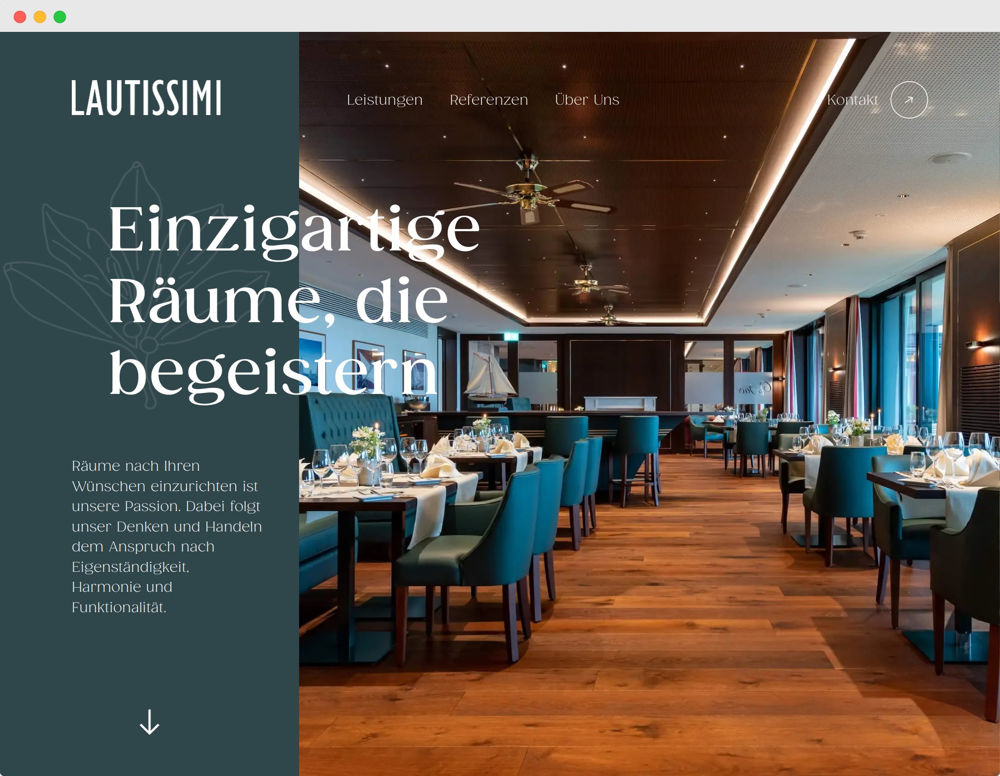

# Lautissimi Website



This repository contains the website for Lautissimi - an interior designer located in Zug.

### How to run the website

```bash
git clone git@github.com:jeromehaas/lautissimi-web.git
cd lautissimi-web
nvm use
npm install
npm run start
```

### Working with DDEV
DDEV is a tool for localhosting. It's a tool built on Docker which provides a LAMP Stack.

Follow the [installation guide](https://test-ddev.readthedocs.io/en/latest/), then run the following command:
```bash
ddev start
ddev describe
ddev import-db --src=/home/{username}/Documents/projects/websites/lautissimi-web-v2/craft/db-backups/220723-01.sql.gz
 ```

The command 'ddev describe will print you a list with all the links for previewing the website and the phpmyadmin-panel.


 To make a database dump run:
 ```
ddev export-db  --file=/home/{username}/Documents/projects/websites/lautissimi-web-v2/craft/db-backups/{date}-{version}.sql.gz
 ```

 For the credentials in the .env file, you can use 'db' for all the fields like this:
 ```
DB_DRIVER=mysql
DB_SERVER=db
DB_PORT=3306
DB_DATABASE=db
DB_USER=db
DB_PASSWORD=db
DB_SCHEMA=public
DB_TABLE_PREFIX=
 ```

 Maybe you need to adjust the versions of specific components of the LAMP stack. You can do this in the '/ddev/config.yml'. Here's an example that should work for most of the cases:
 ```
name: lautissimi-web
type: php
docroot: web
php_version: "8.0"
webserver_type: nginx-fpm
router_http_port: "80"
router_https_port: "443"
xdebug_enabled: false
additional_hostnames: []
additional_fqdns: []
mysql_version: "8.0"
nfs_mount_enabled: false
mutagen_enabled: false
use_dns_when_possible: true
composer_version: "2"
web_environment: []
nodejs_version: "16"
host_db_port: "32223"
 ```

 ### How to run craft
 First install Craft by running the following command in the '/craft' directory:
 ```
composer install
 ```

 Next, generate the security keys and the app-ID:
 ```
php craft setup/security-key
php craft setup/app-id
 ```

 